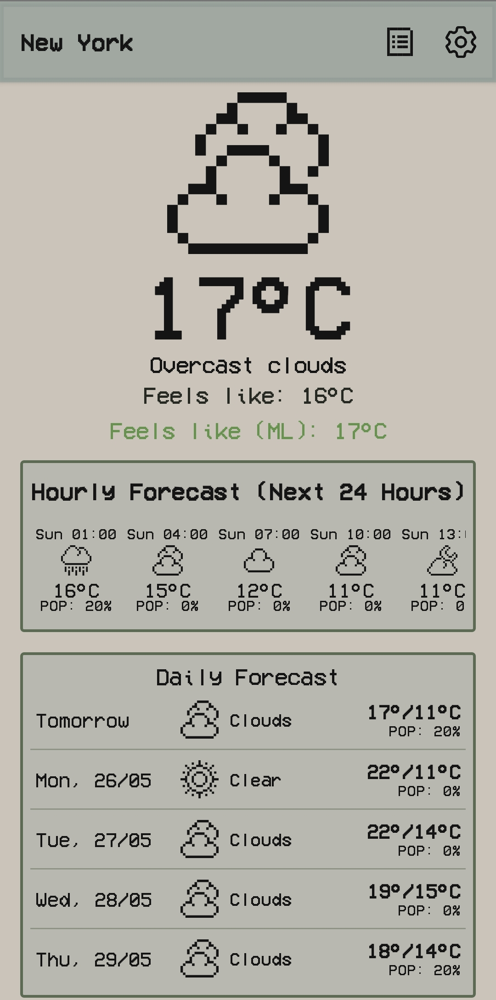
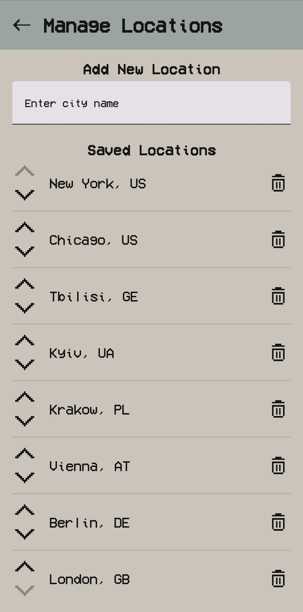
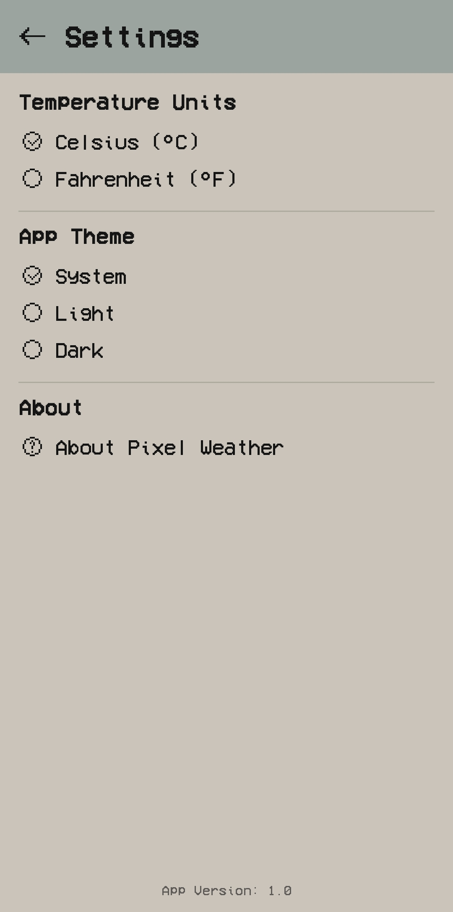

# Pixel Weather App (Diploma Project)

<p align="center">
  <!-- Build & Quality -->
  
  
  <br/>
  <!-- Tech Stack -->
  
  
  
  
  <br/>
  <!-- Repository Stats -->
  
  
  
   
  <!--  -->
  <!--  -->
  <!--  -->
</p>

<p align="center">
  <br/>
  <i>App Icon</i>
</p>

A feature-rich Android weather application with a unique pixel art UI, developed as a diploma
project for the Software Engineering department at Zaporizhzhia National University. This app not
only displays standard weather forecasts from an API but also utilizes a local TensorFlow Lite model
to provide "Feels Like" temperature predictions.

## ✨ Features

* **Current Weather:** Displays current temperature, "feels like" temperature (both from API and ML
  model), weather condition, wind speed & direction, pressure, humidity, and visibility.
* **Hourly Forecast:** Provides a 24-hour (or more) forecast with temperature, weather condition,
  and POP (Probability of Precipitation).
* **Daily Forecast:** Shows a 5-7 day forecast with min/max temperatures, weather conditions, and
  POP.
* **ML-Powered "Feels Like" Temperature:** A custom TensorFlow Lite model predicts the "feels like"
  temperature, offering an alternative to the API's value.
* **Location Services:**
    * Automatic weather display for the current geolocation (with permission).
    * Manual city search with autocomplete suggestions (powered by Geoapify).
    * Ability to save and manage a list of favorite locations.
* **Horizontal Pager Navigation:** Easily swipe between geolocation and saved locations on the main
  screen.
* **Pixel Art UI:** Unique and custom-designed user interface in pixel art style.
* **Customizable Units:** Switch between Celsius and Fahrenheit for temperature.
* **Theme Selection:** Supports system, light, and dark themes.
* **Pull-to-Refresh:** Update weather data manually.
* **Page Indicators:** For easy navigation within the weather pager.
* **Offline Handling:** Basic error messages for network unavailability.
* **Settings Screen:** Manage temperature units and app theme.
* **About Screen:** Information about the app, developer, and resources used.

## 🛠️ Technologies & Architecture

* **Language:** Kotlin
* **UI:** Jetpack Compose (with Material 3 components adapted for pixel art style)
* **Architecture:** MVVM (Model-View-ViewModel) with Clean Architecture principles (UI, Domain, Data
  layers).
* **Asynchronous Programming:** Kotlin Coroutines & Flow
* **Dependency Injection:** Hilt
* **Networking:** Retrofit & OkHttp
* **JSON Serialization:** Kotlinx.Serialization
* **Local Database:** Room Persistence Library (for saved locations)
* **Machine Learning:** TensorFlow Lite (for local "Feels Like" temperature model)
* **Navigation:** Jetpack Compose Navigation
* **Location:** FusedLocationProviderClient
* **APIs:**
    * OpenWeatherMap API (for weather data)
    * Geoapify API (for city autocomplete and reverse geocoding)
* **Build System:** Gradle

## 🖼️ Screenshots

<table>
  <tr>
    <th>Main Screen</th>
    <th>Manage Locations</th>
    <th>Settings Screen</th>
  </tr>
  <tr>
    <td></td>
    <td></td>
    <td></td>
  </tr>
</table>

## 🚀 Getting Started

### Prerequisites

* Android Studio (latest stable version recommended, e.g., Meerkat or newer)
* Android SDK (API Level 26 or higher)
* JDK 21 or higher (project is compiled with Java 21 features)

### Installation & Setup

1. **Clone the repository:**
   ```bash
   git clone https://github.com/ArtemZarubin/PixelArtWeatherML
   ```
2. **Open the project in Android Studio.**
3. **API Keys:**
   This project requires API keys for OpenWeatherMap and Geoapify. You need to:
    * Create a `local.properties` file in the root directory of the project (if it doesn't exist).
    * Add your API keys to this file:
      ```properties
      OPEN_WEATHER_API_KEY=YOUR_OPENWEATHERMAP_API_KEY
      GEOAPIFY_API_KEY=YOUR_GEOAPIFY_API_KEY
      ```
    * Replace `YOUR_OPENWEATHERMAP_API_KEY` and `YOUR_GEOAPIFY_API_KEY` with your actual keys.
    * You can obtain these keys from:
        * OpenWeatherMap: [https://openweathermap.org/api](https://openweathermap.org/api)
        * Geoapify: [https://www.geoapify.com/](https://www.geoapify.com/)
4. **Build the project:**
    * Wait for Android Studio to sync Gradle files.
    * Click `Build > Assemble Project` or run the app directly on an emulator or physical device.

## 🤖 ML Model Details

The "Feels Like" temperature prediction model (`feels_like_final_model.tflite`) is a TensorFlow Lite
model trained on the "Historical Weather Data for different cities around the world" dataset.
It uses the following input features (ensure `prepareAndScaleFeatures` in
`WeatherModelInterpreterImpl.kt` matches this):

* `Temperature (C)`
* `Humidity` (scaled to 0-1)
* `Wind Speed (km/h)` (converted to m/s before scaling if needed)
* `Visibility (km)`
* `Pressure (millibars)`
* `Precip Type_rain` (One-Hot Encoded)
* `Precip Type_snow` (One-Hot Encoded)
* `HourSin`, `HourCos`
* `MonthSin`, `MonthCos`
* `DayOfYearSin`, `DayOfYearCos`
* `WindBearingSin`, `WindBearingCos`

The model was trained using a simple neural network architecture with StandardScaler for input and
output features. The Mean Absolute Error (MAE) on the test set is approximately 0.29 degrees
Celsius.

The complete model training process, including data loading, preprocessing, feature engineering,
model definition, training, and evaluation, can be found in the following Google Colab notebook:
➡️ **[View Model Training Notebook on Google Colab](https://colab.research.google.com/drive/1azhbcOYesQdHLMwZ1gLaPV3ceyr5QpX9?usp=sharing)**

## 📄 License

This project is licensed under the **MIT License**. See the `LICENSE` file for details.

## 🙏 Acknowledgements

* **OpenWeatherMap** for providing the weather data API.
* **Geoapify** for the geocoding and autocomplete APIs.
* **Dataset:** ["Historical Weather Data for different cities around the world" from Kaggle](https://www.kaggle.com/datasets/muthuj7/weather-dataset).
* **Pixel Fonts:** VCR OSD Mono by Riciery Leal.
* **Icons:**
    * Weather Icons: Freepik - Flaticon
    * Arrow Icons: Disha Vaghasiya - Flaticon
    * Settings Icons: Pixel perfect - Flaticon
    * Other Pixel Icons: frelayasia - Flaticon
* **Loading Animation:** Generated using loading.io.
* **Color Palette:** "TY - Fictional Computer OS - 32" by Toby_Yasha (lospec.com).
* **App Icon:** Original art by Olga Baranova (from Vecteezy.com), modified.
* Guidance and supervision by Vitaliy I. Gorbenko.
* Google and the Android Jetpack team for the development tools and libraries.

---
